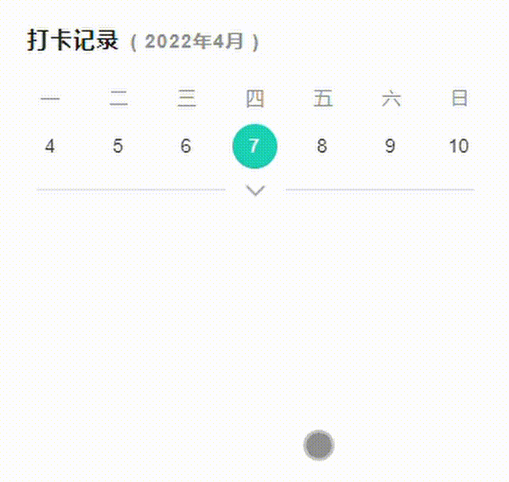

# 日历组件，带标点带展开功能

> /component/calendar 组件主体

> /index 组件演示

## Props

| 属性名         | 说明                                                                                                                         | 类型                                                   | 默认值   |
| -------------- | ---------------------------------------------------------------------------------------------------------------------------- | ------------------------------------------------------ | -------- |
| spotMap        | 标点的日期对象，属性名为具体日期如：y2000m10d10，属性值为'spot'或'deep-spot'，颜色分别为青色和橙色                           | Object                                                 | {}       |
| defaultTime    | 标记的日期，默认为今日，传入格式推荐为'2022/1/2'或'2022/01/02'，否则在 ios 上可能会出现识别错误的情况                        | String                                                 | ''       |
| title          | 日历的标题，默认无                                                                                                           | String                                                 | ''       |
| goNow          | 是否有快速回到今天的功能                                                                                                     | Boolean                                                | true     |
| defaultOpen    | 是否是打开状态                                                                                                               | Boolean                                                | false    |
| showShrink     | 是否显示收缩展开                                                                                                             | Boolean                                                | true     |
| disabledDate   | 要禁用的日期函数，日历在渲染时会主动调用该方法参数为{ day, month, year }对象，当方法返回 true 时会禁用该日期。使用方法见示例 | ({ day: number, month: number, year: number }) => void | ()=>void |
| changeTime     | 要改变的日期，改变即生效。用于 Data 构造函数的第一个参数 传入格式推荐为'2022/1/2'或'2022/01/02'                              | String                                                 | ''       |
| firstDayOfWeek | 周起始日                                                                                                                     | Number 1 ~ 7                                           | 7        |

## Events

| 事件名           | 说明                                                                                                                | 参数值                                      |
| ---------------- | ------------------------------------------------------------------------------------------------------------------- | ------------------------------------------- |
| bind:getDateList | 渲染某个月份， setMonth：渲染的月，setYear：渲染的年 。注意：不能代指现在的月份，在加载时会获取当前月以及上下两月的 | {setMonth: number,setYear: number}          |
| bind:selectDay   | 选中日期的年月日                                                                                                    | { day: number, month: number, year: number} |
| bind:openChange  | 日历切换的状态，true 打开; false 关闭 展开收缩时触发的事件                                                          | { open: boolean }                           |

#### 联系作者

> 微信 gg6630gg
